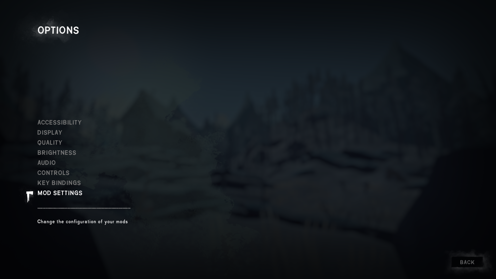
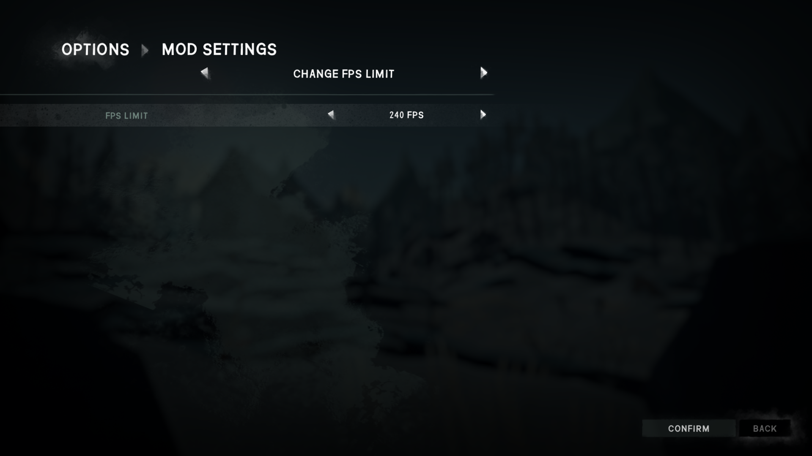

# Change-FPS-Limit

A mod for The Long Dark that lets you change the game's FPS limit, which is usually locked at 120 FPS.

## Installation

1. If you haven't done so already, install the [Mod Loader](https://github.com/zeobviouslyfakeacc/ModLoaderInstaller)
2. Install the mod automatically by using [WulfMarius's Mod-Installer](https://github.com/WulfMarius/Mod-Installer/releases)

or

1. If you haven't done so already, install the [Mod Loader](https://github.com/zeobviouslyfakeacc/ModLoaderInstaller)
2. If you haven't done so already, install [ModSettings](https://github.com/zeobviouslyfakeacc/ModSettings) v1.4 or newer
3. Download the latest version of `Change-FPS-Limit.dll` from the [releases page](https://github.com/zeobviouslyfakeacc/Change-FPS-Limit/releases)
4. Move `Change-FPS-Limit.dll` into the mods folder in your TLD install directory

Alternatively, you can download `Change-FPS-Limit_with_ModSettings.zip` and extract it into your mods directory.

## Configuration

1. In the main menu, select 'Options' and then 'Mod Settings'

   
2. Select 'Change FPS Limit' from the mods list
3. Select the desired FPS limit

   
4. Press the 'Confirm' button and play!
